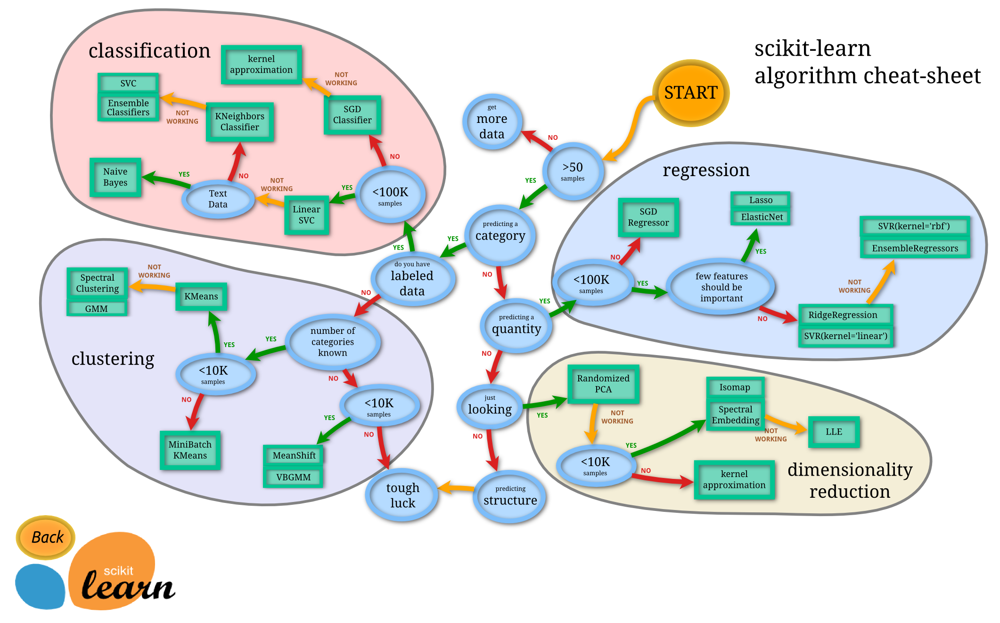

## Engineering Tool Stacks:

### Operating System
Your choice of operating system matters probably more than you think to your data science development and deployment work flow. Following points
describe why Linux/Mac will make you a better developer and saves you hundreds of hours fixing issues you might come across in Windows.

- Portability: if you design your workflow for Linux, it will run almost anywhere, on any cloud provider. Linux also dominates supercomputers, if you ever decide to go big.

- Productivity: The Terminal. You will be surprised just how aware and productive you are once it becomes your primary environment.

- Compatibility: Most libraries used in data research are primarily Unix-based. Python, with all its dependancies, is much easier to install and run on Linux; many libraries will first released in Linux compatible version, and Windows runnable will come usually months after it.

- Stability: An application that hangs mid-process can be a real productivity killer. Linux will be respectful of your time.

- Community: if you do run into a problem on Linux, the solution is likely to be the top search result on Google, and the community is very supportive.

- Control: Being able to monitor and control your hardware resources is very important when we deploy a technology solution that needs permission/ access to computer resources. Linux makes that easy.

- Speed: No latency, things are generally faster in Linux than Windows.

### Code editor

Using rich-featured IDE(Integrated Development Environment) or a lighter code editor comes down to personal preferences. I like to use smaller and quicker code editor, and I use Atom.

Atom is available on all platforms, Atom is billed as the “hackable text editor for the 21st Century.” With a sleek interface, file system browser, and my favorite is the marketplace for extensions.

Highly recommend the following extensions/packages to be installed in Atom:
https://atom.io/packages/atom-beautify
  Beautify your python script
https://atom.io/packages/python-autopep8
  Format python code using autopep8
https://atom.io/packages/docblock-python
  Inserts documentation blocks for python functions

### Virtual Environment

Imagine a scenario where you are working on two python projects and one of them uses a Pandas 1.9 and the other uses Pandas 2.0 and so on. In such situations virtual environment can be really useful to maintain dependencies of both the projects. Virtual environment is a tool helps to keep dependencies required by different projects separate by creating isolated python virtual environments for them.

If you are using Python 3, then you should already have the venv module from the standard library installed.

Tutorial of venv: https://realpython.com/python-virtual-environments-a-primer/

### Package your python project -- setup.py

Package your code to share it with other developers and users makes a great impact. Just like how we install packages using pip and PyPI, packaging your project in a well-established distribution convention makes it easy to share.

Setup.py is the build script for setuptools. It tells setuptools about your package (such as the name and version) as well as which code files to include.

setup() takes several arguments.

- name is the distribution name of your package. Choose a memorable and unique name for your package.
- version is the package version see PEP 440 for more details on versions.
author and author_email are used to identify the author of the package.
description is a short, one-sentence summary of the package.
- packages is a list of all Python import packages that should be included in the distribution package. Instead of listing each package manually, we can use find_packages() to automatically discover all packages and subpackages.
- classifiers gives the index and pip some additional metadata about your package, usually including: python version, license, etc.

More read of package python:https://packaging.python.org/tutorials/packaging-projects/

### Clean code rules

- Functions should do one thing
This is arguably the most important rule in software engineering. When functions do more than one thing, they are harder to compose, test, and reason about. When you can isolate a function to just one action, they can be refactored easily and your code will read much cleaner. If you take nothing else away from this guide other than this, you'll be ahead of many developers.

- Function names should say what they do

- Use docstring
A docstring is a string literal that occurs as the first statement in a module, function, class, or method definition.All modules should normally have docstrings, and all functions and classes exported by a module should also have docstrings.
For consistency, always use """triple double quotes""" around docstrings.

additional docstring reading: https://www.python.org/dev/peps/pep-0257/#what-is-a-docstring

### Test driven development

Unit testing is not generally considered a design pattern; in fact, it might be considered a “development pattern,”. Test-driven development (TDD) is a software development process that relies on the repetition of a very short development cycle: requirements are turned into very specific test cases, then the software is improved so that the tests pass. TDD recommends developers to write test first before writing actual code. The benefits are

- It forces us to describe what the code is supposed to do
- It provide an example of how the code should be used
- It Provide a way to verify when the code is finished (when all the tests run correctly).

I recommend to use Pytest framework which makes it easy to write small tests, and scales to large applications.

### Git
  versioning
  branching
  merging
  pull requests
  issues

### Web server
  flask, more to come

### Serverless
  lambda, more to come

### Docker
  more to come

### Kubernetes
  more to come

## ML/DS/Stats/SQL knowledge

### General ML:
Highly recommend reading through Applied Predictive Modeling book.

- Data scientist shall feel very comfortable describing the pros and cons of different algorithms, when and when not to use certain of them.

- Model Selection, Validation
  example questions:
  how does cross validation work?
  how to select the right model?

- Data manipulation
  Expect to get lots of questions in data manipulation, typically data scientists spend more than 60% of the time cleansing, transforming data at work.
  example questions:
  how do we deal with outliers, nans, missing values, highly skewed variables, highly imbalanced datasets ?

- Feature engineering
  example questions:
  what are the common techniques for feature engineering?
  when shall we scale/standardize/normalize data?
  how do we deal with high cardinality categorical features ?
  how to find relevant features among 1000 variables?
  how to deal with multicollinearity, why it matters?

### Deep learning:
  - Computer Vision/ CNN:
    - can explain different variants of CNN models used for image detection/ identification/ segmentation
    - opencv
  - NLP/ RNN:
    - can explain and expand to elaborate on the pros/cons different variants LSTM/ word embeddings/ attention mechanism/ transformer

  - Prepare to answer the data manipulation(image/text processing,etc), feature engineering(bag of words, embeddings, tf-idf, etc) related questions for deep learning models.

### Reinforcement learning
  more to come

### Recommendation System
  more to come

### Time Series Analysis: ARIMA
  more to come

### Optimization: linear programming, dynamic programming, multi-task optimization
  more to come

### SQL:
  nested select query, different joins, window function(lag, lead, rank,etc)
  https://drill.apache.org/docs/sql-window-functions-introduction/
  https://sqlzoo.net

### Stats: A/B testing
